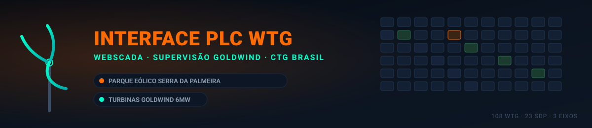

<!-- Início do README -->



# ⚡ Interface PLC WTG

> ⚠️ **Escopo:** este projeto é específico e funciona **somente** para o **Parque Eólico Serra da Palmeira**, da **CTG Brasil**, com **turbinas Goldwind de 6MW**. O mapeamento de IPs e a estrutura de eixos/SDP refletem exclusivamente esse parque — não é um template genérico para outros complexos eólicos.

## 📖 Sobre o Projeto

**Interface PLC WTG** é um painel de acesso rápido (dashboard) para o **WebSCADA / Interface de Supervisão da Turbina Goldwind — CTG Brasil**. A ferramenta organiza os **108 aerogeradores** do complexo eólico por **Eixo** (Norte, Central e Sul) e por **bloco SDP**, permitindo abrir a interface nativa do SCADA de cada turbina — individualmente, por bloco ou de uma só vez — a partir de um único clique.

O objetivo é eliminar a necessidade de digitar manualmente o IP de cada turbina, centralizando o acesso operacional em uma única página.

## 🗺️ Estrutura do Complexo

| Eixo | Blocos SDP | Descrição |
|---|---|---|
| **Eixo Norte** | SDP-1, 2, 3, 4, 6, 7, 8, 13 | Agrupamento norte do complexo |
| **Eixo Central** | SDP-5, 9, 10, 11, 12, 14, 15, 16, 17, 18 | Agrupamento central do complexo |
| **Eixo Sul** | SDP-19, 20, 21, 22, 23 | Agrupamento sul do complexo |

Cada bloco SDP contém um conjunto de aerogeradores, mapeados para um IP local (`192.168.151.X`) correspondente à interface web do PLC da turbina.

## ✨ Funcionalidades

- 🔹 **Acesso individual** — clique em uma turbina para abrir sua interface SCADA em uma nova aba.
- 🔹 **Acesso por bloco** — botão "Abrir Bloco" abre todas as turbinas de um SDP de uma vez (com confirmação).
- 🔹 **Acesso total** — botão "Abrir Todas as Turbinas (1–108)" abre o parque inteiro (com confirmação).
- 🔹 **Visual por eixo** — cada eixo possui uma cor de identificação própria para facilitar a leitura.

## 🛠️ Tecnologias Utilizadas

- **HTML5** — estrutura da página.
- **CSS3** — tema escuro customizado via *CSS variables* (`:root`), layout responsivo com CSS Grid.
- **JavaScript (Vanilla)** — geração dinâmica dos cards e grids, e lógica de abertura dos IPs.

> Não há dependências externas, *build steps* ou frameworks — o projeto roda com um único arquivo `.html`.

## 🚀 Instalação e Execução Local

> ℹ️ Este painel **não é uma página web hospedada** — o GitHub apenas guarda o código-fonte do arquivo `.html`. Para usar de verdade, é preciso baixar o arquivo e abri-lo localmente no computador conectado à rede do parque.

Pré-requisito: apenas um navegador web moderno (Chrome, Edge, Firefox) e conexão com a rede interna do parque (`192.168.151.X`).

**Opção A — Baixar diretamente do GitHub:**

1. Acesse o arquivo `Interface PLC WTG.html` no repositório.
2. Clique em **"Download raw file"** (ou nos três pontos `...` > **Download**).
3. Salve em um local fixo no seu computador, por exemplo: `C:\Users\SCADASDP\Desktop\Interface PLC WTG.html`.
4. Sempre que precisar usar o painel, dê **duplo clique** nesse arquivo para abri-lo no navegador.

**Opção B — Clonar o repositório completo:**
```bash
git clone https://github.com/EmilsonCosta82/Profissional.git
cd Profissional
```

Depois, abra o arquivo diretamente no navegador:
```bash
# Windows
start "Interface PLC WTG.html"

# Linux / macOS
open "Interface PLC WTG.html"
```

> ⚠️ **Atenção:** os botões desta página abrem endereços na faixa `192.168.151.X`, que corresponde à **rede interna/local** do parque eólico. O painel só funciona (e os botões só abrem as turbinas) quando o computador que o executa está conectado a essa rede — não há como acessá-lo remotamente pela internet.

## ⚙️ Configuração / Personalização

> Os valores abaixo já estão calibrados para o **Parque Eólico Serra da Palmeira (CTG Brasil)**. Para usar este painel em outro parque, todo o array `eixos` precisa ser refeito com a topologia real do novo complexo.

O mapeamento dos eixos, blocos SDP e faixas de IP fica centralizado no array `eixos`, dentro da tag `<script>`. Para adicionar, remover ou ajustar um bloco, edite o objeto correspondente:

```javascript
{ nome: "SDP-1", qtd: 6, ipInicio: 1, ipFim: 6 }
```

| Campo | Descrição |
|---|---|
| `nome` | Nome do bloco/subestação (SDP) exibido no card |
| `qtd` | Quantidade de turbinas do bloco |
| `ipInicio` | Último octeto do primeiro IP do bloco |
| `ipFim` | Último octeto do último IP do bloco |

## 🤝 Como Contribuir

1. Faça um *fork* do projeto.
2. Crie uma *branch* para sua funcionalidade (`git checkout -b feature/NovaFuncionalidade`).
3. Faça o *commit* das suas alterações (`git commit -m 'Adiciona nova funcionalidade'`).
4. Faça o *push* para a *branch* (`git push origin feature/NovaFuncionalidade`).
5. Abra um *Pull Request*.

## 📄 Licença

Este projeto é de uso interno/operacional. Ajuste esta seção conforme a licença desejada (ex.: MIT, uso restrito, proprietário).

<!-- Fim do README -->
